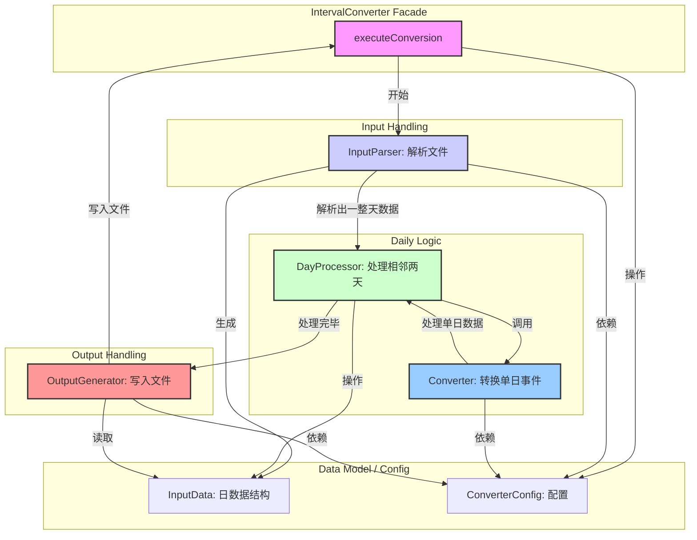

## convertor

```mermaid
graph TD
    subgraph IntervalConverterFacade [IntervalConverter Facade]
        A[executeConversion]
    end

    subgraph Input Handling
        B[InputParser: 解析文件]
    end

    subgraph Daily Logic
        C[DayProcessor: 处理相邻两天]
        D[Converter: 转换单日事件]
    end

    subgraph Output Handling
        E[OutputGenerator: 写入文件]
    end

    subgraph DataModel [Data Model / Config]
        F[InputData: 日数据结构]
        G[ConverterConfig: 配置]
    end

    %% Flow
    A -- 开始 --> B
    B -- 解析出一整天数据 --> C
    C -- 调用 --> D
    D -- 处理单日数据 --> C
    C -- 处理完毕 --> E
    E -- 写入文件 --> A
    
    A -- 操作 --> G
    B -- 依赖 --> G
    B -- 生成 --> F
    C -- 操作 --> F
    D -- 依赖 --> G
    E -- 依赖 --> G
    E -- 读取 --> F
    
    %% Styling
    style A fill:#f9f,stroke:#333,stroke-width:2px
    style B fill:#ccf,stroke:#333,stroke-width:2px
    style C fill:#cfc,stroke:#333,stroke-width:2px
    style D fill:#9cf,stroke:#333,stroke-width:2px
    style E fill:#f99,stroke:#333,stroke-width:2px
```