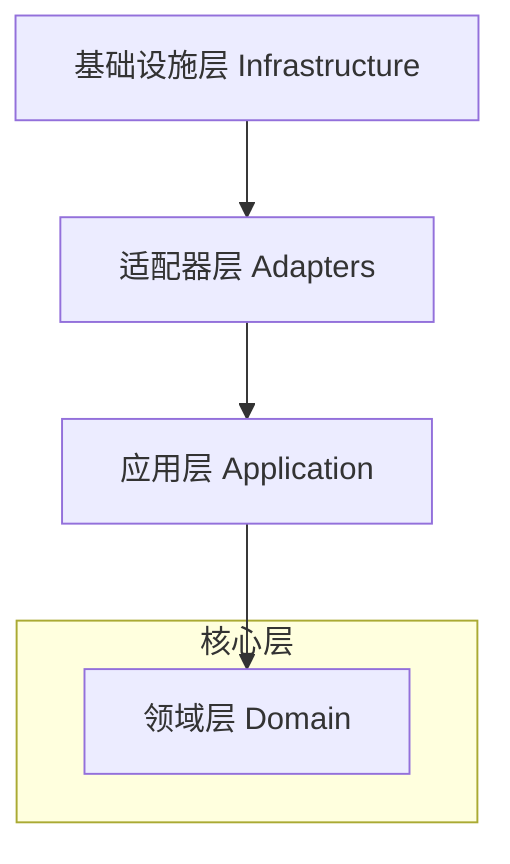

# 系统架构与模块设计 (Architecture & Modules)

本文档详细介绍了 **TimeTracer** 的结构设计。项目采用 **整洁架构 (Clean Architecture)** 原则，通过分层设计确保代码的高度解耦、可测试性和可维护性。

## 0. 整洁架构分层

系统被组织为四个同心层级。核心原则是 **依赖规则 (Dependency Rule)**：依赖关系只能由外层指向内层。

### 0.1 领域层 (Domain Layer) - `src/domain`
*   **职责**: 包含核心业务逻辑和实体。这是系统最稳定的部分，其代码**严禁依赖**任何外部库或其他层。
*   **核心实体**:
    *   **`DailyLog`**: 代表单日时间记录的核心数据结构。
    *   **`TimeRecord`**: 代表单条活动，包含时长、起始时间及元数据。
    *   **`DomainModels`**: 用于内部处理和序列化的纯数据结构。
*   **逻辑**: 包含纯函数，如时长计算、状态判断及基础工具函数。

### 0.2 应用层 (Application Layer) - `src/application`
*   **职责**: 协调用例并定义数据流向。
*   **核心组件**:
    *   **`PipelineManager`**: 负责调度数据摄取的 **管道模式 (Pipeline Pattern)**。
    *   **`Steps`**: 管道中的原子操作（如 `ConverterStep`、`LogicLinkerStep`）。
    *   **`Context`**: `PipelineContext` 负责在各步骤之间传递状态与数据。
*   **接口**: 定义资源访问接口（如 Repository 接口），由基础设施层实现。

### 0.3 适配器层 (Adapters Layer) - `src/adapters`
*   **职责**: 连接应用层与外部交付机制（如 CLI 或特定解析器）。
*   **核心组件**:
    *   **`input/parser`**: 将原始文本输入适配为领域层实体。
    *   **`CliApplication`**: (`src/cli`) 处理 CLI 参数解析并调用对应的应用层服务。

### 0.4 基础设施层 (Infrastructure Layer) - `src/infrastructure`
*   **职责**: 实现技术细节，如数据库持久化、文件 IO 及外部报告生成。
*   **核心组件**:
    *   **`persistence`**: 实现应用层定义的接口，负责 SQLite 数据库操作。
    *   **`io`**: 提供底层的物理文件访问工具。
    *   **`reports`**: 管理外部 DLL 插件，用于生成 LaTeX、Typst 等特定格式报告。

---

## 1. 核心设计模式

### 1.1 管道模式 (Pipeline Pattern)
数据摄取（从文本到数据库）采用线性管道处理：
1.  **文件收集 (`FileCollector`)**: 定位并读取输入文件。
2.  **结构验证 (`StructureValidator`)**: 校验文本语法与格式。
3.  **数据转换 (`Converter`)**: 将文本映射为 `DailyLog` 领域实体。
4.  **逻辑链接 (`LogicLinker`)**: 处理跨天逻辑（如生成深夜睡眠记录）。
5.  **业务验证 (`LogicValidator`)**: 确保数据逻辑的一致性（如时间单调递增）。
6.  **数据持久化 (`Persistence`)**: 存入 SQLite 数据库。

### 1.2 策略模式 (Strategy Pattern)
报告系统使用策略模式支持多格式输出（Markdown, LaTeX, Typst）。重构项目树的逻辑保持通用，而具体的渲染细节外包给不同的策略实现（DLL 插件）。

---

## 2. 工程实践
*   **C++23**: 采用现代特性（如 `std::expected`）优化错误处理。
*   **绝对路径引用**: 内部依赖使用基于 `src/` 的绝对路径，提升代码清晰度。
*   **轻量化依赖**: 核心仅依赖 `sqlite3`、`toml++` 和 `nlohmann/json`。
