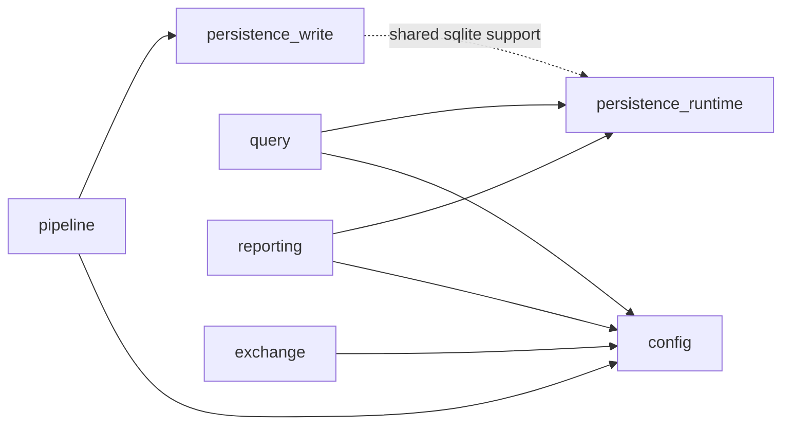

# tracer_core Capability Dependency Map

## Purpose

Provide the authority map for `tracer_core` internal capabilities. Use this
document when the change is already confirmed to belong to `libs/tracer_core`
and you need to know which capability owns the work, what it may depend on,
and which validate entry should be used first.

## When To Open

- Open this before moving code between `pipeline / query / reporting / exchange / config / persistence`.
- Open this before adding new imports, ports, or helper dependencies inside `libs/tracer_core`.
- Open this before defining new focused validate scope files for core refactors.

## What This Doc Does Not Cover

- Cross-library ownership between `tracer_core`, `tracer_transport`,
  `tracer_adapters_io`, and `tracer_core_bridge_common`
- External ABI / runtime JSON / stats payload contracts
- File-by-file implementation walkthroughs

## First-Class Capabilities

| Capability | Owns | Direct Capability Deps | Must Not Depend On |
| --- | --- | --- | --- |
| `pipeline` | convert / ingest / import / validate orchestration and workflow entry | `config`, `persistence_write` | `query`, `reporting`, `exchange` |
| `query` | tree query semantics, data-query repository / orchestrators / renderers / stats | `config`, `persistence_runtime` | `reporting` |
| `reporting` | report query / export / formatter / report-data-query flows | `config`, `persistence_runtime` | `query` |
| `exchange` | tracer-exchange package flows and file-crypto-backed exchange implementation | `config` | `pipeline`, `query`, `reporting` |
| `config` | runtime config loading, snapshotting, validators, report/converter config assembly | none | `pipeline`, `query`, `reporting`, `exchange` orchestration |
| `persistence_write` | ingest/import write-side repositories and sqlite writer chain | support only | `query`, `reporting`, `exchange` |
| `persistence_runtime` | read-side project repository, db health, shared sqlite support | none | `pipeline`, `query`, `reporting`, `exchange` orchestration |

`application/use_cases/tracer_core_api.*`, `application/aggregate_runtime/**`,
`tc_core_iface`, and `tc_infra_full_lib` are composition surfaces. They may
aggregate multiple capabilities, but they are not capability owners.

## Current Capability Graph

The current first-class capability relations are fixed by the target graph in
`libs/tracer_core/infra/CMakeLists.txt`:

- `pipeline -> config + persistence_write`
- `query -> config + persistence_runtime`
- `reporting -> config + persistence_runtime`
- `exchange -> config`

Implementation note:

- `persistence_write` currently reuses `persistence_runtime` sqlite support via
  `tc_infra_persistence_write_lib -> tc_infra_persistence_runtime_lib`.
  Treat this as shared persistence support, not as a new business-capability
  dependency to spread upward into `pipeline`.

## Allowed / Forbidden Dependency Matrix

| From | Allowed Direct Capability Deps | Forbidden Direct Capability Deps |
| --- | --- | --- |
| `pipeline` | `config`, `persistence_write` | `query`, `reporting`, `exchange` |
| `query` | `config`, `persistence_runtime` | `reporting` |
| `reporting` | `config`, `persistence_runtime` | `query` |
| `exchange` | `config` | `pipeline`, `query`, `reporting` |
| `config` | none | `pipeline`, `query`, `reporting`, `exchange` orchestration |
| `persistence_write` | shared persistence support | `query`, `reporting`, `exchange` |
| `persistence_runtime` | none | `pipeline`, `query`, `reporting`, `exchange` orchestration |

## Capability Owners

### pipeline

- Owner paths:
  - `libs/tracer_core/src/application/pipeline/**`
  - `libs/tracer_core/src/application/parser/**`
  - `libs/tracer_core/src/application/workflow*`
  - `libs/tracer_core/src/application/use_cases/pipeline_api.*`
- Validate first with:
  - `python tools/run.py validate --plan tools/toolchain/config/validate/tracer_core/pipeline.toml`

### query

- Owner paths:
  - `libs/tracer_core/src/application/query/tree/**`
  - `libs/tracer_core/src/application/use_cases/query_api.*`
  - `libs/tracer_core/src/infra/query/**`
  - `libs/tracer_core/src/infra/query/data/repository/query_runtime_service*`
- Validate first with:
  - `python tools/run.py validate --plan tools/toolchain/config/validate/tracer_core/query.toml`

### reporting

- Owner paths:
  - `libs/tracer_core/src/application/reporting/**`
  - `libs/tracer_core/src/application/use_cases/report_api*`
  - `libs/tracer_core/src/infra/reporting/**`
- Validate first with:
  - `python tools/run.py validate --plan tools/toolchain/config/validate/tracer_core/reporting.toml`

### exchange

- Owner paths:
  - `libs/tracer_core/src/application/use_cases/tracer_exchange_api.*`
  - `libs/tracer_core/src/infra/exchange/**`
  - `libs/tracer_core/src/infra/crypto/**`
- Validate first with:
  - `python tools/run.py validate --plan tools/toolchain/config/validate/tracer_core/exchange.toml`

### config

- Owner paths:
  - `libs/tracer_core/src/infra/config/**`
- Validate first with:
  - `python tools/run.py validate --plan tools/toolchain/config/validate/tracer_core/config.toml`

### persistence_write

- Owner paths:
  - `libs/tracer_core/src/infra/persistence/importer/**`
  - `libs/tracer_core/src/infra/persistence/sqlite_time_sheet_repository.*`
- Validate first with:
  - `python tools/run.py validate --plan tools/toolchain/config/validate/tracer_core/persistence_write.toml`

### persistence_runtime

- Owner paths:
  - `libs/tracer_core/src/infra/persistence/repositories/**`
  - `libs/tracer_core/src/infra/persistence/sqlite_database_health_checker.*`
  - `libs/tracer_core/src/infra/persistence/sqlite/db_manager.*`
- Validate first with:
  - `python tools/run.py validate --plan tools/toolchain/config/validate/tracer_core/persistence_runtime.toml`

## Escalation Rule

- If the touched paths stay inside one capability and its declared public
  surfaces, start with that capability `paths-file`.
- If the change touches composition surfaces, shared helper paths such as
  `src/infra/internal/**`, or more than one capability, combine explicit paths
  or escalate to `python tools/run.py verify --app tracer_core_shell --profile fast --concise`.
