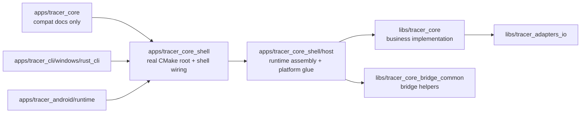

# `tracer_core` 标识与边界说明

日期：2026-03-06

## 1. 对外标识保持兼容

1. 外部兼容 app id 继续保留为 `tracer_core`。
2. 内部推荐语义名为 `tracer_core_shell`。
3. `scripts/run.py` 现已同时支持：
   - `--app tracer_core`
   - `--app tracer_core_shell`
4. Windows CLI 结果目标保持不变：
   - `artifact_windows_cli`

## 2. Phase 6 后的目录职责

### `apps/tracer_core_shell`

仅保留兼容构建根职责：

- `src/CMakeLists.txt`
- `src/pch.hpp`
- `src/pch_sqlite.hpp`
- `src/pch_sqlite_toml.hpp`

不再承载业务源码、测试源码、API 共享实现或临时转发目录。

### `apps/tracer_core_shell`

承载壳层接线与平台集成：

- `api/c_api/`
  - C ABI 导出符号与薄封装
- `api/android_jni/`
  - JNI 注册、方法分发、Java/Kotlin 入口胶水
- `host/`
  - 壳层装配、Android runtime factory、JNI crypto/progress 等 host glue
- `tests/integration/`
  - 壳层集成测试
- `tests/platform/`
  - Android runtime / data_query / file_crypto 等平台侧测试

### `libs`

- `libs/tracer_core`
  - 业务实现（shared/domain/application/infrastructure）
- `libs/tracer_core_bridge_common`
  - C/JNI 复用桥接工具
  - 当前承载 `shared/crypto_progress_json.hpp`

## 3. 当前边界规则

### `apps/tracer_core` 退役后边界

Phase 5 之后，`apps/tracer_core` 已被物理删除。

这意味着已删除的 compat `src` 树不会再恢复，任何新的业务/测试/API 实现文件都必须进入：

- `apps/tracer_core_shell/**`
- `libs/tracer_core/**`
- `libs/tracer_core_bridge_common/**`

### `apps/tracer_core_shell/api/**` 边界

新增 `enforce_shell_api_include_boundary`：

- 默认禁止 `api/**` 直接 `#include "infrastructure/..."`
- 默认禁止继续使用旧共享胶水路径 `#include "api/shared/..."`
- Android JNI 侧的深层 infrastructure 装配已下沉到 `host/**`

### 兼容例外

当前 `api/c_api` 仍保留两处 ABI 薄封装例外：

- `api/c_api/tracer_core_c_api.cpp`
- `api/c_api/tracer_core_c_api_crypto.cpp`

这两处仍是 C ABI 出口文件，但其职责应保持为稳定 ABI 封装，不再扩散为新的 host/infra 接线入口。

## 4. Phase 6 收口结果

1. `libs/tracer_core/src/infrastructure/tests/**` 已迁至：
   - `apps/tracer_core_shell/tests/platform/infrastructure/tests/**`
2. `libs/tracer_core_bridge_common/src/shared/crypto_progress_json.hpp` 已迁至：
   - `libs/tracer_core_bridge_common/src/shared/crypto_progress_json.hpp`
3. `android_runtime_factory*` 与 JNI crypto/progress host glue 已迁至：
   - `apps/tracer_core_shell/host/**`

## 5. 拓扑图

## 6. 维护原则

1. 新的业务实现只进入 `libs/**`。
2. 新的平台装配只进入 `apps/tracer_core_shell/host/**`。
3. `api/c_api` 与 `api/android_jni` 只保留平台入口与薄封装。
4. 若需新增跨 C/JNI 复用的桥接工具，优先放入 `libs/tracer_core_bridge_common/**`。
