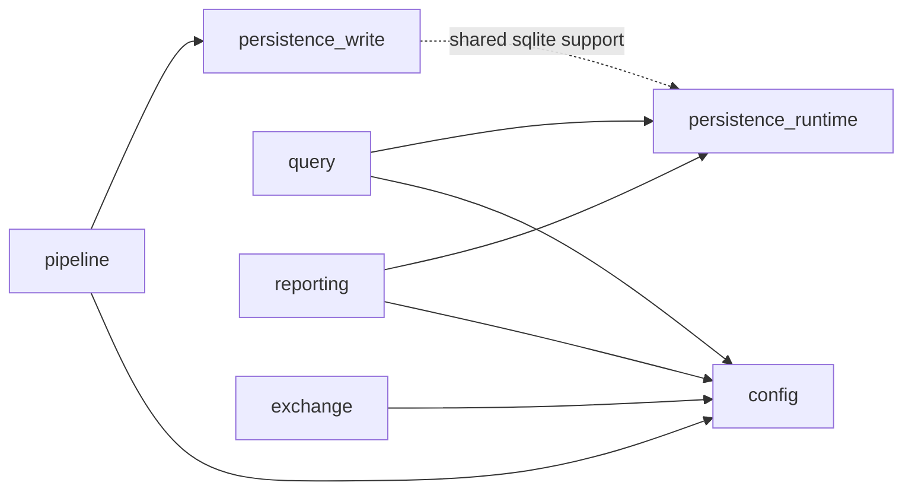

# tracer_core Capability Map

## Purpose

This document is the overview-level authority map for `tracer_core`
capabilities. Use it when the change is already confirmed to belong to
`libs/tracer_core` and you need to know:
1. which capability owns the work
2. which direct capability dependencies are allowed
3. which validate entry should run first

## First-Class Capabilities

| Capability | Owns | Direct Capability Deps | Must Not Depend On |
| --- | --- | --- | --- |
| `pipeline` | convert / ingest / import / validate orchestration and workflow entry | `config`, `persistence_write` | `query`, `reporting`, `exchange` |
| `query` | tree query semantics, data-query repository / orchestrators / renderers / stats | `config`, `persistence_runtime` | `reporting` |
| `reporting` | report query / export / formatter / report-data-query flows | `config`, `persistence_runtime` | `query` |
| `exchange` | tracer-exchange package flows and file-crypto-backed exchange implementation | `config` | `pipeline`, `query`, `reporting` |
| `config` | runtime config loading, snapshotting, validators, report/converter config assembly | none | capability orchestration |
| `persistence_write` | ingest/import write-side repositories and sqlite writer chain | support only | `query`, `reporting`, `exchange` |
| `persistence_runtime` | read-side project repository, db health, shared sqlite support | none | capability orchestration |

Composition surfaces such as `application/use_cases/tracer_core_api.*`,
`application/aggregate_runtime/**`, `tc_core_iface`, and `tc_infra_full_lib`
may aggregate multiple capabilities, but they are not capability owners.

## Current Capability Graph

The target graph remains:
1. `pipeline -> config + persistence_write`
2. `query -> config + persistence_runtime`
3. `reporting -> config + persistence_runtime`
4. `exchange -> config`

`persistence_write` may reuse `persistence_runtime` sqlite support internally,
but that does not become a new upward business-capability dependency.

## Validate First

1. `pipeline`
   - `python tools/run.py validate --plan tools/toolchain/config/validate/tracer_core/pipeline.toml`
2. `query`
   - `python tools/run.py validate --plan tools/toolchain/config/validate/tracer_core/query.toml`
3. `reporting`
   - `python tools/run.py validate --plan tools/toolchain/config/validate/tracer_core/reporting.toml`
4. `exchange`
   - `python tools/run.py validate --plan tools/toolchain/config/validate/tracer_core/exchange.toml`
5. `config`
   - `python tools/run.py validate --plan tools/toolchain/config/validate/tracer_core/config.toml`
6. `persistence_write`
   - `python tools/run.py validate --plan tools/toolchain/config/validate/tracer_core/persistence_write.toml`
7. `persistence_runtime`
   - `python tools/run.py validate --plan tools/toolchain/config/validate/tracer_core/persistence_runtime.toml`

## Read Next
1. [module_boundaries.md](module_boundaries.md)
2. [identity_and_boundary.md](identity_and_boundary.md)
3. [../capabilities/validation/README.md](../capabilities/validation/README.md)
4. [../capabilities/ingest/README.md](../capabilities/ingest/README.md)
