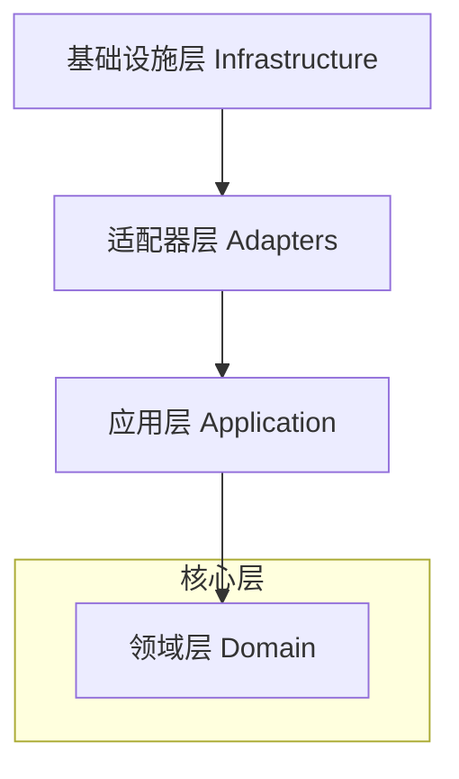

# 系统架构与模块设计 (Architecture & Modules)

本文档详细介绍了 **TimeTracer** 的结构设计。项目采用 **整洁架构 (Clean Architecture)** 原则，通过分层设计确保代码的高度解耦、可测试性和可维护性。

## 0. 整洁架构分层

系统被组织为四个同心层级。核心原则是 **依赖规则 (Dependency Rule)**：依赖关系只能由外层指向内层。

### 0.1 领域层 (Domain Layer) - `src/domain`
*   **职责**: 包含核心业务逻辑和实体。这是系统最稳定的部分。
*   **子目录**:
    *   **`logic/`**: 包含业务逻辑、验证器 (`validator/`) 和转换器 (`converter/`)。
    *   **`model/`**: 核心数据实体（如 `DailyLog`, `TimeRecord`）。
    *   **`types/`**: 领域特定的基础类型定义。
    *   **`reports/`**: 报表领域模型与类型定义（例如 ReportData、ReportFormat）。

### 0.2 应用层 (Application Layer) - `src/application`
*   **职责**: 协调用例并定义数据流向。
*   **子目录**:
    *   **`importer/`**: 数据导入服务。
    *   **`bootstrap/`**: 系统启动与环境自检逻辑。
    *   **`pipeline/`**: 摄取管道核心架构。
    *   **`adapters/`**: 与外部系统的轻量级适配（如解析器）。

### 0.3 接口层 (API Layer) - `src/api`
*   **职责**: 处理外部交付机制。
*   **子目录**:
    *   **`cli/`**: 命令行界面的实现（原根目录 `cli/` 已移至此处）。

### 0.4 基础设施层 (Infrastructure Layer) - `src/infrastructure`
*   **职责**: 实现底层技术细节。
*   **子目录**:
    *   **`config/`**: 配置管理与验证。
    *   **`persistence/`**: 数据库持久化（SQLite）。
    *   **`serialization/`**: 数据序列化（JSON）。
    *   **`io/`**: 物理文件系统访问。
    *   **`reports/`**: 报表查询、格式化与导出实现（含插件加载与共享组件）。

### 0.5 共享层 (Shared Layer) - `src/shared`
*   **职责**: 跨层通用的工具类与基础类型。
*   **子目录**:
    *   **`utils/`**: 通用工具函数。
    *   **`types/`**: 跨层使用的基础类型规范。

### 0.6 边界与禁区 (Boundary & No-Go Zones)
以下规则用于保证“高内聚、低耦合”，并作为后续重构与审查基线：

| 源层 | 允许依赖 | 禁止依赖 |
| --- | --- | --- |
| `domain` | `domain`, `shared` | `application`, `api`, `infrastructure` |
| `application` | `domain`, `application`, `shared` | `api`, `infrastructure`（具体实现头） |
| `api/cli` | `application`（use_case + dto + ports）, `domain`（必要枚举） | `infrastructure`（具体实现与技术细节） |
| `infrastructure` | `domain`, `application` 契约, `shared` | 反向让核心层依赖基础设施 |

补充约束：
*   **`ports/interfaces/dto/abi` 保持独立**：这些是跨层契约文件，不因“减少文件数”而合并。
*   **`api/cli` 不承载业务规则**：仅负责参数解析、请求映射、响应映射、退出码与文本输出。
*   **`infrastructure` 承载技术细节**：SQLite、文件系统、插件加载、序列化等实现必须下沉到基础设施层。
*   **“是否合并文件”的判定**：仅当文件“总是一起改、只服务同一功能、无跨层复用”时才合并。

---

## 1. 核心设计模式

### 1.1 管道模式 (Pipeline Pattern)
数据摄取（从文本到数据库）采用线性管道处理：
1.  **文件收集 (`FileCollector`)**: 定位并读取输入文件。
2.  **结构验证 (`StructureValidator`)**: 校验文本语法与格式。
3.  **数据转换 (`Converter`)**: 将文本映射为 `DailyLog` 领域实体。
4.  **逻辑链接 (`LogicLinker`)**: 处理跨天逻辑（如生成深夜睡眠记录）。
5.  **业务验证 (`LogicValidator`)**: 确保数据逻辑的一致性（如时间单调递增）。
6.  **数据持久化 (`Persistence`)**: 存入 SQLite 数据库。

### 1.2 策略模式 (Strategy Pattern)
报告系统使用策略模式支持多格式输出（Markdown, LaTeX, Typst）。重构项目树的逻辑保持通用，而具体的渲染细节外包给不同的策略实现（DLL 插件）。

---

## 2. 工程实践
*   **C++23**: 采用现代特性（如 `std::expected`）优化错误处理。
*   **绝对路径引用**: 内部依赖使用基于 `src/` 的绝对路径，提升代码清晰度。
*   **轻量化依赖**: 核心仅依赖 `sqlite3`、`toml++` 和 `nlohmann/json`。
