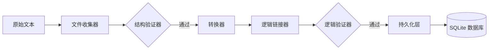

# 核心程序流程 (Core Workflows)

本文档通过剖析内部数据流向与执行步骤，详细展示了 TimeTracer 关键命令的运作机制。

## 1. 全链路摄取流水线 (`run-pipeline` / `blink`)

`run-pipeline` (别名: `blink`) 是系统的核心命令，负责执行从原始日志文本读取到数据库持久化存储的完整闭环。

### 1.1 管道化执行架构
摄取过程由 **`PipelineManager`** 统一驱动，按照预定义序列执行一系列原子步骤。

**数据流向图:**

**关键执行步骤:**
1.  **文件收集 (Collection)**: `FileCollector` 递归扫描目标目录，将所有匹配的 `.txt` 日志读入内存。
2.  **结构验证 (Structural Validation)**: `StructureValidatorStep` 检查文本是否符合年份/日期块嵌套规则。若语法错误，流水线将执行 **快速失败 (Fail-fast)** 并终止任务。
3.  **核心转换 (Conversion)**: `ConverterStep` 利用 `ActivityMapper` 将原始文本映射为带有语义路径的领域实体 (`DailyLog`)。
4.  **跨天链接 (Logical Linking)**: `LogicLinkerStep` 分析连续日期的衔接关系，自动推导并补全深夜睡眠记录。
5.  **业务校验 (Logical Validation)**: `LogicValidatorStep` 确保时间轴无重叠、无“穿越”，且满足最小活动密度等业务约束。
6.  **数据落盘 (Persistence)**: `PersistenceStep` 调用 `ImportService` 将校验后的实体模型批量提交至 SQLite 数据库。

---

## 2. 工具辅助工作流

### 2.1 转换命令 (`convert`)
旨在将原始文本转化为结构化的 JSON 归档。此流程常用于数据备份、调试或人工审核转换结果。

**执行路径:**
`物理硬盘 (.txt)` -> **[摄取管道: 转换器]** -> `领域实体 (DailyLog)` -> **[序列化器: JsonSerializer]** -> `物理硬盘 (.json)`

### 2.2 导入命令 (`import`)
支持将已有的 JSON 归档文件批量快速导入数据库。

**执行路径:**
`物理硬盘 (.json)` -> **[适配器: 解析器]** -> `领域实体 (DailyLog)` -> **[应用层: 导入服务]** -> `基础设施: SQLite`

---

## 3. 报表生成工作流

该流程由 `query` 或 `export` 指令触发，专注于从结构化存储中重构人类可读的多维报告。

**执行路径:**
`SQLite` -> **[基础设施: 持久化]** -> `扁平记录条目` -> **[应用层: 树重构器]** -> `项目树 (内存模型)` -> **[基础设施: 格式化策略]** -> `可视化报表 (MD, Tex, Typ)`

**核心逻辑阶段:**
1.  **数据提取 (Fetch)**: 从数据库中按时间范围检索所有相关的原始活动记录。
2.  **树形重构 (Reconstruction)**: `TreeReconstructor` 根据项目路径（如 `study/coding/cpp`）将零散的扁平记录重新聚合为一颗层级化的项目树，并计算每一层级的累计时长。
3.  **动态渲染 (Transformation)**: 系统根据用户指定的格式加载对应的 DLL 插件。具体的渲染策略遍历内存项目树，将其转换为格式化的字符串流。
