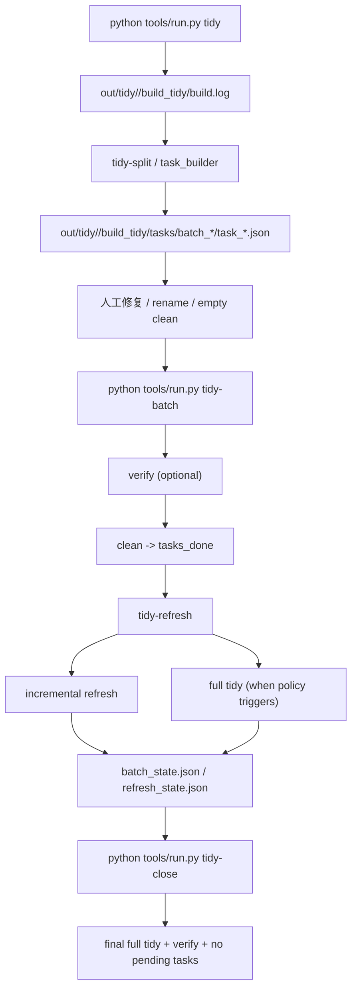

# Clang-Tidy 工作流与状态文件

本文档补充 `docs/toolchain/clang_tidy_architecture.md`，专门描述 clang-tidy Python 工具链的执行流与落盘状态。

如果你已经知道“文件大概在哪”，但还不确定“命令之间怎么串”、“失败后看哪个 JSON”，优先看这里。

默认示例里写的 `build_tidy` 表示“默认全量 tidy workspace”。

如果命令显式带了：

- `--source-scope core_family`
- `--build-dir build_tidy_core_family`（用于 `tidy` / `tidy-split` / `tidy-refresh`）
- `--tidy-build-dir build_tidy_core_family`（用于 `tidy-fix` / `clean` / `tidy-batch` / `tidy-close` / `tidy-loop` / `tidy-flow` / `tidy-task-*` / `tidy-step`）

那么整条工作流会切到独立的 scoped workspace：`out/tidy/tracer_core_shell/build_tidy_core_family`。

`core_family` 只覆盖下面 4 个 libs 的生产源码：

- `libs/tracer_core/src`
- `libs/tracer_adapters_io/src`
- `libs/tracer_core_bridge_common/src`
- `libs/tracer_transport/src`

## 1. 主流程总览



## 2. `tidy`：生成任务

命令：

```bash
python tools/run.py tidy --app tracer_core_shell
python tools/run.py tidy --app tracer_core_shell --source-scope core_family --build-dir build_tidy_core_family
```

执行链路：

1. `tools/run.py`
2. `tools/toolchain/cli/handlers/tidy/tidy.py`
3. `tools/toolchain/commands/tidy/command.py`
4. `tools/toolchain/commands/tidy/command_execute.py`
5. `tools/toolchain/commands/tidy/invoker.py`
6. `tools/toolchain/commands/tidy/log_splitter.py`
7. `tools/toolchain/commands/tidy/task_builder.py`

关键行为：

1. 检查 `out/tidy/<app>/<tidy_workspace>/CMakeCache.txt`
2. 如果未配置或 header filter cache 失效，则自动 configure
3. 执行 `cmake --build <tidy_workspace_dir> --target tidy`
4. 将输出写入 `out/tidy/<app>/<tidy_workspace>/build.log`
5. 将 `build.log` 拆成 `tasks/batch_*/task_*.json`
   - 如配置 `--task-view`，再额外渲染 `task_*.log` / `task_*.toon`
6. 生成 `tasks/tasks_summary.md`
7. 写 `out/tidy/<app>/<tidy_workspace>/tidy_result.json`

补充：

- 在真正调用 clang-tidy 前，工具链会先生成 `analysis_compile_db/compile_commands.json`
- 这份 compile db 会从原始 `compile_commands.json` 去掉 `@*.obj.modmap`
- 这是 clang-tidy 的唯一官方分析输入；raw build `compile_commands.json` 不再属于 clang-tidy contract

输出重点：

- `out/tidy/<app>/<tidy_workspace>/build.log`
- `out/tidy/<app>/<tidy_workspace>/analysis_compile_db/compile_commands.json`
- `out/tidy/<app>/<tidy_workspace>/tasks/batch_*/task_*.json`
- `out/tidy/<app>/<tidy_workspace>/tasks/tasks_summary.md`
- `out/tidy/<app>/<tidy_workspace>/tidy_result.json`

## 3. `tidy-split`：仅重拆日志

命令：

```bash
python tools/run.py tidy-split --app tracer_core_shell
```

适用场景：

- 已经有 `build.log`
- 想调整 `max_lines` / `max_diags` / `batch_size`
- 不想重新跑整次 tidy build

实现文件：

- `tools/toolchain/commands/tidy/command_split.py`
- `tools/toolchain/commands/tidy/task_builder.py`

注意：

- `tidy-split` 不会重新执行 clang-tidy
- 只会读取现有 `build.log`

## 4. `clean`：把任务从 `tasks/` 归档到 `tasks_done/`

命令：

```bash
python tools/run.py clean --app tracer_core_shell --batch-id <BATCH_ID> <TASK_ID>
python tools/run.py clean --app tracer_core_shell --tidy-build-dir build_tidy_core_family --batch-id <BATCH_ID> <TASK_ID>
```

实现文件：

- `tools/toolchain/commands/tidy/clean.py`

核心职责：

1. 将 `tasks/batch_xxx/task_yyy.json` 移到 `tasks_done/batch_xxx/task_yyy.json`
2. 可选 `--cluster-by-file`
   - 同一源码文件相关 task 一次性归档
3. 可选 `--strict`
   - 要求最新 verify 成功
   - 要求 verify 结果时间晚于 task log
   - 要求 verify 结果时间晚于源码更新时间
4. 写回 `batch_state.json`

失败优先排查：

1. `out/test/<suite>/result.json`
2. task record 里的 `source_file`
3. `out/tidy/<app>/<tidy_workspace>/batch_state.json`

## 5. `tidy-refresh`：按批次增量 refresh，必要时升级 full tidy

命令：

```bash
python tools/run.py tidy-refresh --app tracer_core_shell --batch-id <BATCH_ID>
python tools/run.py tidy-refresh --app tracer_core_shell --source-scope core_family --build-dir build_tidy_core_family --batch-id <BATCH_ID>
```

执行链路：

1. `tools/toolchain/commands/tidy/refresh.py`
2. `tools/toolchain/commands/tidy/refresh_internal/refresh_execute.py`
3. `tools/toolchain/commands/tidy/refresh_internal/refresh_mapper.py`
4. `tools/toolchain/commands/tidy/refresh_internal/refresh_runner.py`
5. `tools/toolchain/commands/tidy/refresh_internal/refresh_state.py`
6. `tools/toolchain/commands/tidy/refresh_internal/refresh_state_flow.py`

刷新逻辑：

1. 从 `tasks_done/<batch>/task_*.json` 提取 touched files
2. 读取 `out/tidy/<app>/<tidy_workspace>/analysis_compile_db/compile_commands.json`
3. 将 touched files 映射到 compile units
4. 执行增量 clang-tidy，日志写到 `refresh/<batch>/incremental_tidy_*.log`
5. 满足以下条件之一时，自动升级为 full tidy：
   - `--force-full`
   - `--final-full`
   - cadence 到点（`full_every`）
   - 增量日志出现 `no such file` / `glob mismatch`
   - rename 报告里 `already_renamed` 比例过高
6. 更新 `refresh_state.json`
7. 同步更新 `batch_state.json`
8. 重新写 `tidy_result.json`

核心状态文件：

- `out/tidy/<app>/<tidy_workspace>/refresh_state.json`
  - `batches_since_full`
  - `processed_batches`
  - `last_batch`
  - `last_full_at`
  - `last_full_batch`
  - `last_full_reason`
  - `last_seen_build_log_mtime_ns`
  - `last_seen_rename_report_mtime_ns`

### 5.1 为什么会自动 full tidy

直接看：

1. `refresh_state.json` 的 `last_full_reason`
2. `refresh/<batch>/incremental_tidy_*.log`
3. `out/tidy/<app>/<tidy_workspace>/build.log`
4. `out/tidy/<app>/<tidy_workspace>/rename/rename_apply_report.json`

判断代码主要在：

- `tools/toolchain/commands/tidy/refresh_internal/refresh_execute.py`
- `tools/toolchain/commands/tidy/refresh_internal/refresh_policy.py`

## 6. `tidy-batch`：单批次标准收口

命令：

```bash
python tools/run.py tidy-batch --app tracer_core_shell --batch-id <BATCH_ID> --preset sop
python tools/run.py tidy-batch --app tracer_core_shell --source-scope core_family --tidy-build-dir build_tidy_core_family --batch-id <BATCH_ID> --preset sop
```

这是推荐的单批次收口入口。

执行阶段：

1. verify（可选）
2. clean
3. refresh
4. finalize

实现文件：

- `tools/toolchain/commands/tidy/batch.py`
- `tools/toolchain/commands/tidy/batch_internal/tidy_batch_checkpoint.py`
- `tools/toolchain/commands/tidy/batch_internal/tidy_batch_pipeline.py`

checkpoint 行为：

- checkpoint 存在于 `batch_state.json` 的 `tidy_batch_checkpoint` 字段
- 如果中断，下一次同样的 `tidy-batch` 会从 `next_stage` 继续

批次成功后会更新：

- `out/tidy/<app>/<tidy_workspace>/batch_state.json`
  - `batch_id`
  - `cleaned_task_ids`
  - `last_verify_success`
  - `last_refresh_ok`
  - `last_tidy_batch_ok`
  - `tidy_batch_checkpoint = null`
- `out/tidy/<app>/<tidy_workspace>/tidy_result.json`

### 6.1 `tidy-batch` 失败时看什么

| 失败阶段 | 优先看 |
| --- | --- |
| verify 失败 | `out/test/<suite>/result.json`、verify 构建日志 |
| clean 失败 | `clean.py` 的 strict guard 条件、对应 `task_*.json` |
| refresh 失败 | `refresh_state.json`、`incremental_tidy_*.log`、`build.log` |
| timeout | `batch_state.json` 中的 `tidy_batch_checkpoint.next_stage` |

## 7. `tidy-close`：整个队列收尾

命令：

```bash
python tools/run.py tidy-close --app tracer_core_shell --keep-going --concise
python tools/run.py tidy-close --app tracer_core_shell --source-scope core_family --tidy-build-dir build_tidy_core_family --keep-going --concise
```

职责：

1. 强制执行一次 final full tidy
2. 可选跑 verify（`--tidy-only` 会跳过）
3. 确认 `tasks/` 下已经没有剩余 `task_*.json`
4. 写回 `batch_state.json`
5. 写回 `tidy_result.json`

实现文件：

- `tools/toolchain/commands/tidy/close.py`

如果 `tidy-close` 失败但 verify 已经成功，最常见原因是：

- `tasks/` 里仍然有未清空任务

## 8. `tidy-loop`：自动清理 rename-only / empty task

命令：

```bash
python tools/run.py tidy-loop --app tracer_core_shell --n 10 --test-every 3 --concise
python tools/run.py tidy-loop --app tracer_core_shell --tidy-build-dir build_tidy_core_family --n 10 --test-every 3 --concise
```

职责：

1. 选取当前最前面的 task
2. 分类为：
   - `rename_only`
   - `empty`
   - `manual`
3. 对 `rename_only`：
   - 执行 rename plan / apply / audit
   - clean 掉任务
4. 对 `empty`：
   - 直接 clean
5. 对 `manual`：
   - 停下并返回 2
6. 按 `test_every` 周期跑 verify

说明：

- `tidy-loop` 仍只处理 `rename_only` / `empty`
- 需要 task-local 源码自动修复时，改用下面的 `tidy-task-*` / `tidy-step`

实现文件：

- `tools/toolchain/commands/tidy/loop.py`
- `tools/toolchain/commands/tidy/flow_internal/loop_tasks.py`
- `tools/toolchain/commands/tidy/flow_internal/loop_verify.py`

返回码语义：

- `0`：本轮完成
- `2`：遇到需要人工处理的 task，循环主动停止

### 8.1 `tidy-task-patch` / `tidy-task-fix`：task 级安全自动化

命令：

```bash
python tools/run.py tidy-task-patch --app tracer_core_shell --source-scope core_family --tidy-build-dir build_tidy_core_family --batch-id 002 --task-id 011
python tools/run.py tidy-task-fix --app tracer_core_shell --source-scope core_family --tidy-build-dir build_tidy_core_family --batch-id 002 --task-id 011 --dry-run
```

职责：

1. 读取单个 `task_*.json`
2. 识别可安全自动处理的模式：
   - `readability-identifier-naming` 的 rule-driven const rename
   - `readability-redundant-casting` 的 same-type cast 去除
3. 输出 candidate patch / apply report
4. 把 report 写到 `out/tidy/<app>/<tidy_workspace>/automation/`

实现文件：

- `tools/toolchain/commands/tidy/task_log.py`
- `tools/toolchain/commands/tidy/task_auto_fix.py`
- `tools/toolchain/commands/tidy/task_fix.py`
- `tools/toolchain/commands/tidy/task_patch.py`

### 8.2 `tidy-task-suggest`：半自动重构建议

命令：

```bash
python tools/run.py tidy-task-suggest --app tracer_core_shell --source-scope core_family --tidy-build-dir build_tidy_core_family --batch-id 002 --task-id 011
```

职责：

1. 基于 task 对应源码生成结构化建议
2. 当前重点覆盖：
   - decode helper 抽取建议
   - protocol / magic number constant 提取建议
3. 结果写到 `automation/*_suggest.{json,md}`

实现文件：

- `tools/toolchain/commands/tidy/task_suggest.py`
- `tools/toolchain/commands/tidy/task_auto_fix.py`

### 8.3 `tidy-step`：单步执行器

命令：

```bash
python tools/run.py tidy-step --app tracer_core_shell --source-scope core_family --tidy-build-dir build_tidy_core_family --batch-id 002 --task-id 011 --dry-run
```

职责：

1. 选择一个 task（默认最小 pending task）
2. 执行 `tidy-task-fix`
3. 非 dry-run 时执行 `verify --scope task`
4. 若当前 batch 只有这一个 task，则自动转入 `tidy-batch --preset sop`
5. 写回 `automation/tidy_step_last.json`

实现文件：

- `tools/toolchain/commands/tidy/step.py`

## 9. `tidy-flow`：全自动编排入口

命令：

```bash
python tools/run.py tidy-flow --app tracer_core_shell --all --test-every 3
python tools/run.py tidy-flow --app tracer_core_shell --source-scope core_family --tidy-build-dir build_tidy_core_family --all --test-every 3
```

职责不是“替代 SOP”，而是“自动串一遍通用流程”。

阶段顺序：

1. `prepare_tasks`
   - 可选 `tidy-fix`
   - 生成 / 刷新 task logs
2. `rename`
   - rename plan / apply / audit
   - 某些情况下自动触发 full tidy rebuild
3. `verify`
   - configure
   - build
   - suite verify
4. `loop`
   - 自动处理 rename-only / empty task
5. `clean`
   - 清理空任务

实现文件：

- `tools/toolchain/commands/tidy/flow.py`
- `tools/toolchain/commands/tidy/flow_internal/flow_execute.py`
- `tools/toolchain/commands/tidy/flow_internal/flow_prepare_phase.py`
- `tools/toolchain/commands/tidy/flow_internal/flow_rename_phase.py`
- `tools/toolchain/commands/tidy/flow_internal/flow_verify_phase.py`
- `tools/toolchain/commands/tidy/flow_internal/flow_loop_clean_phase.py`
- `tools/toolchain/commands/tidy/flow_internal/flow_state.py`

状态文件：

- `out/tidy/<app>/<tidy_workspace>/flow_state.json`

重点字段：

- `status`
- `phase`
- `steps.prepare_tasks.status`
- `steps.rename.status`
- `steps.verify.status`
- `steps.loop.status`
- `steps.clean.status`
- `pending_task_ids`
- `blocked_task_id`
- `rename_candidates`
- `tidy_fix_exit_code`

## 10. `tidy_result.json`：给人和 agent 的统一出口

几乎所有 clang-tidy 主命令结束后，都会更新：

```text
out/tidy/<app>/<tidy_workspace>/tidy_result.json
```

实现文件：

- `tools/toolchain/commands/tidy/tidy_result.py`

这个文件统一汇总：

- 当前 stage
- status
- exit_code
- 剩余任务数 / 已归档任务数
- blocking files
- 各类 fix strategy 统计
- `next_action`

排障建议：

1. 先看 `next_action`
2. 再看 `blocking_files[0]`
3. 再去打开对应 `task_*.json`

## 11. 给 agent 的最短排障顺序

遇到 clang-tidy 工具链问题时，建议按这个顺序看：

1. `out/tidy/<app>/<tidy_workspace>/tidy_result.json`
2. `out/tidy/<app>/<tidy_workspace>/batch_state.json`
3. `out/tidy/<app>/<tidy_workspace>/refresh_state.json`
4. `out/tidy/<app>/<tidy_workspace>/flow_state.json`
5. `out/tidy/<app>/<tidy_workspace>/tasks/batch_*/task_*.json`
6. `out/tidy/<app>/<tidy_workspace>/refresh/<batch>/incremental_tidy_*.log`
7. `out/tidy/<app>/<tidy_workspace>/build.log`

如果只改参数层，不要直接钻到 `commands/`；
如果只改执行算法，也不要先改文档里的命令示例。
