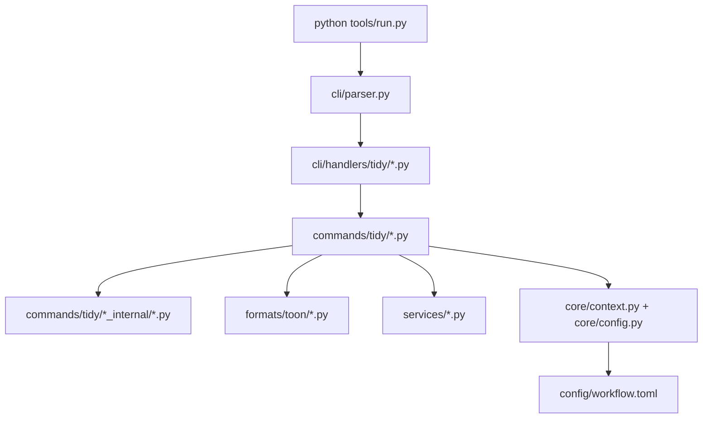

# Clang-Tidy Python 工具链架构图谱

本文档面向要修改 `tools/` 下 clang-tidy Python 工具链的人类开发者与 agent。

目标不是替代 `SOP`，而是回答下面几个更具体的问题：

1. clang-tidy 相关代码现在分布在哪些目录？
2. 改某一类行为时，应该先看哪个文件？
3. 哪些文件负责“参数层”、哪些文件负责“执行层”、哪些文件负责“状态/报告层”？
4. 出现任务拆分、批次收口、增量 refresh、rename 自动处理相关问题时，应该从哪里切入？

建议阅读顺序：

1. 本文：先建立目录与职责地图
2. `docs/toolchain/tidy/flow.md`：再看命令流转与状态文件
3. `docs/toolchain/command_map/python.md`：快速查命令入口
4. `docs/toolchain/tidy/sop.md`：看标准操作流程

## 1. 总入口与分层

clang-tidy 工具链的唯一官方入口是：

```bash
python tools/run.py ...
```

整体分为 4 层：

1. 入口层
   - `tools/run.py`
2. CLI 参数层
   - `tools/toolchain/cli/parser.py`
   - `tools/toolchain/cli/handlers/tidy/*.py`
3. 工作流编排层
   - `tools/toolchain/commands/tidy/*.py`
   - `tools/toolchain/commands/tidy/*_internal/*.py`
4. 基础能力 / 状态 / 解析层
   - `tools/toolchain/formats/toon/*.py`
   - `tools/toolchain/services/*.py`
   - `tools/toolchain/core/*.py`
   - `tools/toolchain/config/workflow.toml`

可以把它理解为：



## 1.1 source scope / tidy workspace 新约定

- `--source-scope <preset>` 是正式入口参数，用于选中一组命名的 C++ 源码根目录
- 第一组内建 preset 是 `core_family`
  - `libs/tracer_core/src`
  - `libs/tracer_adapters_io/src`
  - `libs/tracer_core_bridge_common/src`
  - `libs/tracer_transport/src`
- `core_family` 只覆盖生产源码，不含 `tests/`，也不含 app host `src/`
- 默认全量队列仍使用逻辑 workspace 名 `build_tidy`，物理目录为 `out/tidy/<app>/build_tidy`
- scoped 队列使用独立 workspace；`core_family` 默认是 `out/tidy/tracer_core_shell/build_tidy_core_family`
- 所有队列状态路径与 CMake scope 注入都先经过 `tools/toolchain/commands/tidy/workspace.py`

## 2. 改动路由速查

下面这张表是给 agent 用的“先去哪看”清单。

| 需求 | 优先查看文件 |
| --- | --- |
| 改 `tidy` / `tidy-refresh` / `tidy-batch` / `tidy-flow` 参数 | `tools/toolchain/cli/handlers/tidy/*.py` |
| 改 task 级自动 patch / fix / suggest / step 参数 | `tools/toolchain/cli/handlers/tidy/tidy_task_*.py`、`tools/toolchain/cli/handlers/tidy/tidy_step.py` |
| 改 `python tools/run.py tidy ...` 的执行主链 | `tools/toolchain/commands/tidy/command.py`、`tools/toolchain/commands/tidy/command_execute.py` |
| 改 `cmake --build ... --target tidy` 的拼装方式 | `tools/toolchain/commands/tidy/invoker.py` |
| 改 `build.log` 到 task records / task views 的拆分策略 | `tools/toolchain/commands/tidy/task_builder.py`、`tools/toolchain/commands/tidy/log_splitter.py` |
| 改 `task_*.toon` / `issue_*.toon` 的编码格式 | `tools/toolchain/formats/toon/*.py` |
| 改诊断解析规则 | `tools/toolchain/services/log_parser.py` |
| 改任务优先级排序 | `tools/toolchain/services/task_sorter.py` |
| 改批次收口（verify -> clean -> refresh -> finalize） | `tools/toolchain/commands/tidy/batch.py` |
| 改 clean 归档规则 / strict 时序校验 | `tools/toolchain/commands/tidy/clean.py` |
| 改增量 refresh 的 touched-file -> compile-unit 映射 | `tools/toolchain/commands/tidy/refresh_internal/refresh_mapper.py` |
| 改 refresh 的“何时自动 full tidy”策略 | `tools/toolchain/commands/tidy/refresh_internal/refresh_policy.py`、`tools/toolchain/commands/tidy/refresh_internal/refresh_state.py` |
| 改 `tidy-flow` 编排步骤 | `tools/toolchain/commands/tidy/flow_internal/*.py` |
| 改 rename-only / empty task 自动循环清理 | `tools/toolchain/commands/tidy/loop.py`、`tools/toolchain/commands/tidy/flow_internal/loop_tasks.py` |
| 改状态 JSON / 汇总 JSON 格式 | `tools/toolchain/services/batch_state.py`、`tools/toolchain/commands/tidy/refresh_internal/refresh_state.py`、`tools/toolchain/commands/tidy/flow_internal/flow_state.py`、`tools/toolchain/commands/tidy/tidy_result.py` |
| 改 fix strategy 分类 | `tools/toolchain/commands/tidy/fix_strategy.py`、`tools/toolchain/core/config.py`、`tools/toolchain/config/workflow.toml` |
| 改 clang-tidy 命令入口 / task view 参数 | `tools/toolchain/cli/handlers/tidy/tidy.py`、`tools/toolchain/cli/handlers/tidy/tidy_split.py`、`tools/toolchain/commands/tidy/task_builder.py` |

## 3. 目录职责拆解

### 3.1 `tools/toolchain/cli/handlers/tidy/`

这一层只负责“参数协议”，不负责真实业务逻辑。

- `tidy.py`
  - 定义 `tidy` 命令参数
- `tidy_split.py`
  - 定义 `tidy-split`
- `tidy_refresh.py`
  - 定义 `tidy-refresh`
- `tidy_batch.py`
  - 定义 `tidy-batch`
- `tidy_close.py`
  - 定义 `tidy-close`
- `tidy_loop.py`
  - 定义 `tidy-loop`
- `tidy_flow.py`
  - 定义 `tidy-flow`
- `tidy_fix.py`
  - 定义 `tidy-fix`
- `tidy_task_fix.py`
  - 定义 `tidy-task-fix`
- `tidy_task_patch.py`
  - 定义 `tidy-task-patch`
- `tidy_task_suggest.py`
  - 定义 `tidy-task-suggest`
- `tidy_step.py`
  - 定义 `tidy-step`
- 这一层也负责新增 `--source-scope` / `--tidy-build-dir` 等参数协议
  - 只定义参数
  - 不维护路径列表、glob 或状态目录规则

如果问题表现为：

- 参数名不对
- 帮助文本不对
- 默认值不对
- wrapper 传了参数但 `run.py` 不认

先看这里。

### 3.2 `tools/toolchain/commands/tidy/`

这是 clang-tidy 工作流的“主业务层”。

- `command.py`
  - `tidy` 主入口
  - 负责串联 configure / build / split / result summary
- `command_execute.py`
  - `tidy` 执行主线
  - 做 auto-configure、执行 build、解析 `build.log`
- `command_split.py`
  - `tidy-split` 主线
  - 只从已有 `build.log` 重建任务，不重新跑 build
- `invoker.py`
  - 负责拼装和执行 `cmake --build <build_dir> --target tidy`
  - 同时管理 header filter cache 校验
- `workspace.py`
  - 负责解析 `source_scope`
  - 负责解析默认 tidy workspace
  - 负责生成 `TT_CLANG_TIDY_SOURCE_SCOPE` / `TT_CLANG_TIDY_SOURCE_ROOTS`
- `analysis_compile_db.py`
  - 负责生成 `analysis_compile_db/compile_commands.json`
  - 会从原始 `compile_commands.json` 去掉 `@*.obj.modmap`
  - 用于避免 clang-tidy 在模块扫描产物未生成时直接失败
- `task_builder.py`
  - 把 `build.log` 切成 canonical `task_*.json`
  - 根据当前队列 contract 可选渲染 `task_*.log` / `task_*.toon`
  - full rebase / full refresh 时沿用当前 pending 队列最小的 `batch_NNN` / `task_NNN` 命名空间，不回卷到 `batch_001`
  - 做 section 分组、诊断聚类、优先级排序、batch 写盘
- `log_splitter.py`
  - 日志读取、split 调用、ninja timing 汇总
- `clean.py`
  - 把已完成任务从 `tasks/` 移到 `tasks_done/`
  - 严格模式下做 verify 时序守卫
- `refresh.py`
  - `tidy-refresh` 主入口
  - 负责增量 refresh / 必要时自动 full tidy
- `batch.py`
  - `tidy-batch` 主入口
  - 批次收口编排：verify -> clean -> refresh -> finalize
- `close.py`
  - `tidy-close` 主入口
  - 做 final full tidy + verify + “确认没有剩余任务”
- `loop.py`
  - `tidy-loop` 主入口
  - 自动处理 rename-only / empty task
- `task_log.py`
  - 单个 task record 的解析 / 选择 / batch/task id 解析
  - 优先读取 `task_*.json`，仅兼容旧 `task_*.log`
- `task_auto_fix.py`
  - task 级自动化 facade / 兼容入口
  - 对外维持旧 CLI / report contract，内部转到 `commands/tidy/autofix/`
- `autofix/`
  - task 级自动化内部实现
  - 按 `models.py` / `registry.py` / `orchestrator.py` / `rules/` / `engines/` / `analyzers/` 分层
- `task_fix.py`
  - `tidy-task-fix` 主入口
- `task_patch.py`
  - `tidy-task-patch` 主入口
- `task_suggest.py`
  - `tidy-task-suggest` 主入口
- `step.py`
  - `tidy-step` 主入口
  - 串联 task fix -> task verify -> optional tidy-batch
- `flow.py`
  - `tidy-flow` 主入口
  - 把 prepare / rename / verify / loop / clean 串起来
- `fix.py`
  - `tidy-fix` 主入口
  - 执行 `tidy-fix` / `tidy_fix_step_N` target
- `tidy_result.py`
  - 生成 `tidy_result.json`
  - 给人和 agent 一个统一的“下一步建议”

### 3.3 `tools/toolchain/commands/tidy/batch_internal/`

这是 `tidy-batch` 的内部辅助层。

- `tidy_batch_checkpoint.py`
  - 读写批次 checkpoint
  - 存在 `batch_state.json` 的 `tidy_batch_checkpoint` 字段里
- `tidy_batch_pipeline.py`
  - stage 跳转判断
  - timeout 判断
  - 调用 `TidyRefreshCommand`

### 3.4 `tools/toolchain/commands/tidy/refresh_internal/`

这是 `tidy-refresh` 的核心。

- `refresh_execute.py`
  - refresh 主流程
  - 决定是只做 incremental，还是自动升级为 full tidy
- `refresh_mapper.py`
  - 从 `tasks_done/<batch>/task_*.json` 提取 touched files
  - 将 touched files 映射到 `analysis compile db` 里的 compile units
- `refresh_runner.py`
  - 执行 incremental clang-tidy chunk
  - 也负责调用 full tidy
- `refresh_state.py`
  - 维护 `refresh_state.json`
  - 记录 cadence、processed_batches、last_full_reason 等
- `refresh_state_flow.py`
  - 把 refresh 结果同步回 `batch_state.json`
- `refresh_policy.py`
  - 自动 full tidy 的策略辅助
  - 例如 `no such file`、`glob mismatch`、`high already_renamed`

如果问题是：

- “为什么这个 batch 会触发 full tidy？”
- “为什么 touched files 映射出来的 compile units 不对？”
- “为什么 cadence 没有增长 / 重复增长？”

优先看这里。

### 3.5 `tools/toolchain/commands/tidy/flow_internal/`

这是 `tidy-flow` 的编排层。

- `flow_runner.py`
  - `TidyFlowOptions` 数据模型
- `flow_execute.py`
  - `tidy-flow` 的总 orchestrator
- `flow_prepare_phase.py`
  - 负责 pre-pass `tidy-fix`
  - 负责生成 / 刷新 task logs
- `flow_rename_phase.py`
  - 负责 rename plan / apply / audit
  - 处理 `already_renamed` 比例过高时自动 full tidy
- `flow_verify_phase.py`
  - 负责 configure / build / suite verify
- `flow_loop_clean_phase.py`
  - 负责调用 `tidy-loop`
  - 顺带清理 empty task
- `flow_stages.py`
  - phase 共享的小工具
  - 例如统计 rename candidates、列出 task id、empty task 清理
- `flow_state.py`
  - 维护 `flow_state.json`

如果需求是“想让 tidy-flow 多一步 / 少一步 / 改某一步失败后的行为”，直接看这里。

### 3.6 `tools/toolchain/services/`

clang-tidy 相关主要有这些基础服务：

- `log_parser.py`
  - 从日志中提取 diagnostics
  - 提取 rename candidates
  - 生成 task summary 文本
- `task_sorter.py`
  - 根据 check 类型、头文件风险、warning 数量给任务排序
- `batch_state.py`
  - 维护 `out/tidy/<app>/<tidy_workspace>/batch_state.json`

这层尽量保持“无工作流编排”，适合放纯函数和格式处理。

## 4. 配置落点

clang-tidy 相关默认配置主要在：

1. `tools/toolchain/config/workflow.toml`
2. `tools/toolchain/core/config.py`

重点字段：

- `max_lines`
- `max_diags`
- `batch_size`
- `jobs`
- `parse_workers`
- `keep_going`
- `header_filter_regex`
- `run_fix_before_tidy`
- `fix_limit`
- `auto_full_on_no_such_file`
- `auto_full_on_glob_mismatch`
- `auto_full_on_high_already_renamed`
- `auto_full_already_renamed_ratio`
- `auto_full_already_renamed_min`
- `[tidy.fix_strategy]`

判断原则：

- 改“默认策略”先看配置
- 改“执行算法”再看 `commands/tidy/**`
- 改“字段模型/默认值兜底”再看 `core/config.py`

## 5. 关键产物与状态文件

clang-tidy 主工作目录是：

```text
out/tidy/<app>/<tidy_workspace>/
```

其中：

- 默认全量队列：`<tidy_workspace> = build_tidy`
- `core_family` scoped 队列：`<tidy_workspace> = build_tidy_core_family`

最关键的文件如下：

| 路径 | 作用 |
| --- | --- |
| `out/tidy/<app>/<tidy_workspace>/build.log` | `tidy` build 原始日志 |
| `out/tidy/<app>/<tidy_workspace>/analysis_compile_db/compile_commands.json` | clang-tidy 唯一官方输入；供分析使用的 sanitized compile db（剥离 `@*.obj.modmap`） |
| `out/tidy/<app>/<tidy_workspace>/.ninja_log` | Ninja 执行时序，用于 timing summary |
| `out/tidy/<app>/<tidy_workspace>/tasks/batch_*/task_*.json` | canonical 待处理任务；单 task 自动化应优先以它为真实来源 |
| `out/tidy/<app>/<tidy_workspace>/tasks/batch_*/task_*.log` | 可选 text 视图 |
| `out/tidy/<app>/<tidy_workspace>/tasks/batch_*/task_*.toon` | 可选 TOON 视图；面向 agent 的紧凑语义格式，保留源码片段与建议 hint，省略纯视觉 caret marker |
| `out/tidy/<app>/<tidy_workspace>/tasks/tasks_summary.md` | 拆分后的任务摘要 |
| `out/tidy/<app>/<tidy_workspace>/tasks_done/batch_*/task_*.json` | canonical 已归档任务 |
| `out/tidy/<app>/<tidy_workspace>/tidy_result.json` | 面向人和 agent 的统一状态摘要 |
| `out/tidy/<app>/<tidy_workspace>/batch_state.json` | 批次级状态、checkpoint、verify/refresh 结果 |
| `out/tidy/<app>/<tidy_workspace>/refresh_state.json` | refresh cadence 与 last_full 记录 |
| `out/tidy/<app>/<tidy_workspace>/flow_state.json` | tidy-flow 执行状态 |
| `out/tidy/<app>/<tidy_workspace>/refresh/<batch>/incremental_tidy_*.log` | 增量 refresh 分片日志 |
| `out/tidy/<app>/<tidy_workspace>/rename/rename_candidates.json` | rename plan 候选 |
| `out/tidy/<app>/<tidy_workspace>/rename/rename_apply_report.json` | rename apply 结果报告 |
| `out/test/<suite>/result.json` | strict clean / verify gate 依赖的测试总结果 |

agent 排查建议：

1. 先看 `tidy_result.json`
2. 再看 `batch_state.json` / `refresh_state.json` / `flow_state.json`
3. 最后再深入 `task_*.json`（必要时再看 `.toon` / `.log` 视图）、`build.log`、`incremental_tidy_*.log`

## 6. 常见场景应该从哪里进

### 6.1 `tidy` 能跑，但任务拆得不合理

优先看：

1. `tools/toolchain/commands/tidy/task_builder.py`
2. `tools/toolchain/services/log_parser.py`
3. `tools/toolchain/services/task_sorter.py`

关键词：

- `group_ninja_sections`
- `process_ninja_section`
- `write_task_batches`
- `extract_diagnostics`
- `calculate_priority_score`

### 6.2 `tidy-refresh` 映射的文件不对

优先看：

1. `tools/toolchain/commands/tidy/refresh_internal/refresh_mapper.py`
2. `tools/toolchain/commands/tidy/refresh_internal/refresh_execute.py`
3. `tools/toolchain/commands/tidy/refresh_internal/refresh_state.py`

关键词：

- `load_compile_units`
- `resolve_incremental_files`
- `neighbor_scope`
- `processed_batches`
- `batches_since_full`

### 6.3 `tidy-batch` 经常停在某个阶段

优先看：

1. `tools/toolchain/commands/tidy/batch.py`
2. `tools/toolchain/commands/tidy/batch_internal/tidy_batch_checkpoint.py`
3. `tools/toolchain/commands/tidy/clean.py`
4. `tools/toolchain/commands/tidy/refresh.py`

关键词：

- `next_stage`
- `timeout_seconds`
- `strict_clean`
- `resume_checkpoint`

### 6.4 `tidy-flow` 的自动 rename / loop 行为不符合预期

优先看：

1. `tools/toolchain/commands/tidy/flow_internal/flow_execute.py`
2. `tools/toolchain/commands/tidy/flow_internal/flow_rename_phase.py`
3. `tools/toolchain/commands/tidy/flow_internal/loop_tasks.py`
4. `tools/toolchain/commands/tidy/loop.py`

关键词：

- `rename_candidates`
- `already_renamed`
- `rename_only`
- `empty`
- `manual`

## 7. Windows 使用说明

在 Windows 上，如果要直接运行 PowerShell 侧命令并希望尽量避免中文输出乱码，优先使用 `pwsh`。

例如直接用 `pwsh` 调统一入口：

```powershell
pwsh -Command "python tools/run.py tidy --app tracer_core_shell"
```

如果是在 Git Bash / MSYS 环境，应用侧 wrapper 已经会优先探测 `python`、`py`、`python3`，并统一转到 `tools/run.py`。

## 8. 维护建议

1. 新增 clang-tidy 子命令时：
   - 先加 `cli/handlers/tidy/*.py`
   - 再加 `commands/tidy/*.py`
   - 若有状态文件，再补文档
2. 修改状态 JSON 结构时：
   - 同步检查 `tidy_result.json` 的 `next_action`
   - 同步更新本文和 `docs/toolchain/tidy/sop.md`
3. 修改批次流转时：
   - 同步检查 `tidy-batch`、`tidy-refresh`、`tidy-close`
   - 因为这三者共享同一个 tidy workspace 状态目录
4. 修改 rename 自动化时：
   - 同步检查 `tidy-flow` 和 `tidy-loop`
   - 因为两者都可能触发 rename / clean

## 9. 最后一句话版心智模型

如果只记一件事，可以记这个：

- `tidy` 负责“生成任务”
- `clean` 负责“归档任务”
- `refresh` 负责“按批次补扫 / 必要时全量重扫”
- `batch` 负责“单批次收口”
- `close` 负责“全队列收尾”
- `flow` 负责“自动化串联 rename + verify + loop”
